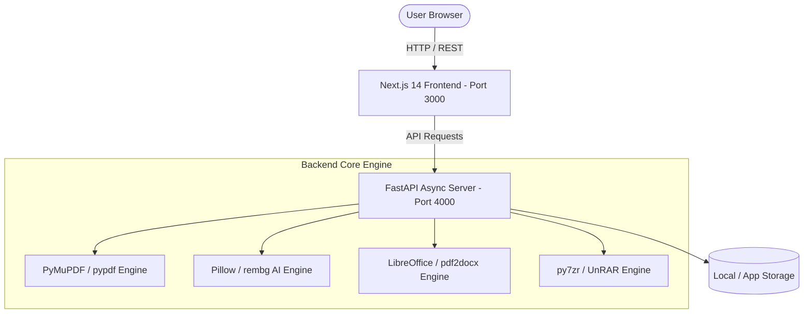

# 🛠️ AllTools — All-in-One Digital File & Resume Processing Platform

<div align="center">

  <h1>✨ AllTools Platform</h1>
  <p><b>An enterprise-grade, high-performance web platform for PDF operations, image processing, archive conversions, and ATS resume creation.</b></p>

  [](https://nextjs.org/)
  [](https://fastapi.tiangolo.com/)
  [](https://www.python.org/)
  [](https://tailwindcss.com/)
  [](https://www.docker.com/)
  [](LICENSE)

</div>

---

## 📌 Overview

**AllTools** is an open-source, full-stack digital utility workspace engineered to replace fragmented online file tools with a single, private, and lightning-fast web application. 

It equips developers, students, and professionals with a unified dashboard to perform complex file manipulations — from merging sensitive PDFs and converting office documents to AI background removal and building ATS-friendly resumes — without external API caps or file size limits.

---

## ✨ Features & Capabilities

### 📄 Comprehensive PDF Suite
| Tool | Description | Engine / Tech |
| :--- | :--- | :--- |
| **PDF Merge** | Combine multiple PDF documents into a single file with custom page order. | `pypdf` |
| **PDF Split** | Extract specific pages, ranges (`1-3,5`), or split every page into a ZIP archive. | `pypdf`, `PyMuPDF` |
| **PDF Remove Pages** | Interactively preview thumbnail grids and drop unwanted pages. | `PyMuPDF` |
| **PDF Compress** | Optimize stream content and shrink file size without loss of visual clarity. | `pypdf` |
| **PDF to Word / Excel / PPT** | Convert PDF documents into editable Word (`.docx`), Excel (`.xlsx`), or PPT files. | `pdf2docx`, `pdfplumber`, `LibreOffice` |
| **Word / PPT / Excel to PDF** | High-fidelity rendering of Microsoft Office documents into PDF format. | `LibreOffice` |
| **HTML to PDF** | Render live web pages or raw HTML snippets into print-ready A4 PDFs. | `Playwright` / `xhtml2pdf` |
| **PDF Security** | Protect documents with AES-256 password encryption or remove open protections. | `pypdf` |
| **PDF OCR & Text Extraction**| Extract raw text layers from digital and scanned PDFs for searchability. | `PyMuPDF` |

### 🖼️ Image & Media Studio
| Tool | Description | Engine / Tech |
| :--- | :--- | :--- |
| **Format Transcoder** | Lossless format conversion across JPG, PNG, and WEBP formats. | `Pillow` |
| **AI Background Removal** | Isolate subjects and remove image backgrounds using deep neural networks. | `rembg` (U2Net AI) |
| **Smart Image Resizer** | Scale images by exact dimensions (`width` x `height`) or scale percentage. | `Pillow` (LANCZOS) |
| **Image Compression** | Reduce image size while adjusting output quality sliders (1–100%). | `Pillow` |

### 🗜️ Archive Converter
| Tool | Description | Engine / Tech |
| :--- | :--- | :--- |
| **ZIP ↔ RAR ↔ 7Z** | Convert between standard archive formats seamlessly with multi-file compression. | `py7zr`, `rarfile`, `WinRAR` |

### 💼 ATS Resume Builder
| Feature | Description |
| :--- | :--- |
| **ATS Score Analysis** | Real-time resume text parsing against job description keywords. |
| **Professional Templates** | Industry-standard layouts (Harvard, Modern, Tech, Creative). |
| **Split-Pane Live Preview** | Instant dual-pane editing with real-time PDF rendering. |

---

## ⚙️ Architecture & Tech Stack



- **Frontend:** Next.js 14 (App Router), React 18, Tailwind CSS, Google Drive & Dropbox Picker API Integration.
- **Backend:** FastAPI, Uvicorn, Python 3.10+, PyMuPDF, Pillow, rembg, pdf2docx, py7zr, Playwright.
- **Storage:** Self-contained file handling with local temporary upload lifecycle management.

---

## 🚀 Quick Start Guide

### Prerequisites
- **Node.js**: `v18.0` or higher
- **Python**: `v3.10` or higher
- **Git**: Installed on your system

---

### 1. Clone Repository
```bash
git clone https://github.com/saivikas35/All-Tolls.git
cd All-Tolls
```

---

### 2. Backend Setup
```bash
cd backend

# Create virtual environment
python -m venv venv

# Activate virtual environment
# Windows:
venv\Scripts\activate
# Linux/macOS:
# source venv/bin/activate

# Install dependencies
pip install -r requirements.txt

# Start FastAPI server
uvicorn app.main:app --reload --port 4000
```
> 📍 **Backend API will run at:** `http://localhost:4000`  
> 📖 **Interactive Swagger Documentation:** `http://localhost:4000/docs`

---

### 3. Frontend Setup
Open a new terminal session:
```bash
cd frontend

# Install dependencies
npm install

# Start Next.js development server
npm run dev
```
> 📍 **Frontend Web App will run at:** `http://localhost:3000`

---

## 🐳 Docker Deployment

Run the complete full-stack platform using Docker Compose:

```bash
docker-compose up --build
```

This starts both services in isolated containers:
- **Frontend Container:** Port `3000`
- **Backend Container:** Port `4000`

---

## 🧪 Testing & Verification

AllTools includes an automated diagnostic test suite to verify end-to-end endpoint functionality:

```bash
# Run backend test suite
python test_tools_4000.py
```

Expected Output:
```text
============================================================
AllTools Backend Endpoint Tests (port 4000)
============================================================
[OK] PDF Merge: PASS
[OK] PDF Split: PASS
[OK] PDF Remove Pages: PASS
[OK] PDF Compress: PASS
[OK] PDF OCR: PASS
[OK] PDF to JPG: PASS
[OK] JPG to PDF: PASS
[OK] PDF to Word: PASS
[OK] Word to PDF: PASS
[OK] PPT to PDF: PASS
[OK] Excel to PDF: PASS
[OK] HTML to PDF: PASS
[OK] PDF Protect (Password): PASS
[OK] PDF to Excel: PASS
[OK] JPG to PNG: PASS
[OK] PNG to JPG: PASS
[OK] JPG to WEBP: PASS
[OK] WEBP to PNG: PASS
[OK] Image Compress: PASS
[OK] Remove Background: PASS
[OK] Image Resizer: PASS
[OK] ZIP to RAR: PASS
[OK] RAR to ZIP: PASS
[OK] Feedback: PASS

RESULTS: 24/24 tools PASSED
```

---

## 📁 Repository Structure

```text
All-Tolls/
├── backend/
│   ├── app/
│   │   ├── routes/              # Modular API endpoints
│   │   │   ├── archives.py      # ZIP/RAR conversion handlers
│   │   │   ├── convert.py       # PDF to Word route handlers
│   │   │   ├── feedback.py      # Feedback submission endpoint
│   │   │   ├── html_pdf.py      # HTML to PDF rendering engine
│   │   │   ├── images.py        # Image processing & AI background removal
│   │   │   ├── office.py        # Office document to PDF engine
│   │   │   ├── pdf_convert.py   # PDF image conversions & OCR
│   │   │   └── pdf_ops.py       # PDF merge, split, remove, compress, security
│   │   ├── utils.py             # File saving & parameter cleaning utilities
│   │   └── main.py              # FastAPI app initialization & CORS middleware
│   ├── requirements.txt         # Python package requirements
│   └── Dockerfile               # Backend container recipe
│
├── frontend/
│   ├── src/
│   │   ├── app/                 # Next.js App Router pages
│   │   │   ├── ats-score/       # ATS resume analysis UI
│   │   │   ├── convert/         # Tool pages (Split, Resizer, Password, etc.)
│   │   │   └── resume-builder/  # Interactive resume builder
│   │   ├── components/          # Reusable React components
│   │   └── lib/                 # Client utilities & Drive pickers
│   ├── tailwind.config.js       # Tailwind CSS configuration
│   └── package.json             # Node.js dependencies
│
├── docker-compose.yml           # Multi-container orchestrator
├── test_tools_4000.py           # Automated test suite
└── README.md                    # Project documentation
```

---

## 🤝 Contributing

Contributions, bug reports, and feature requests are welcome!

1. **Fork** the repository
2. **Create** a feature branch (`git checkout -b feature/AmazingFeature`)
3. **Commit** your changes (`git commit -m 'Add AmazingFeature'`)
4. **Push** to the branch (`git push origin feature/AmazingFeature`)
5. **Open** a Pull Request

---

## 🔒 Security

For security vulnerabilities or sensitive reports, please contact the maintainer directly via GitHub rather than opening public issues.

---

## 📄 License

Distributed under the MIT License. See [`LICENSE`](LICENSE) for details.

---

<div align="center">

Made with ❤️ by [Sai Vikas](https://github.com/saivikas35)

</div>
